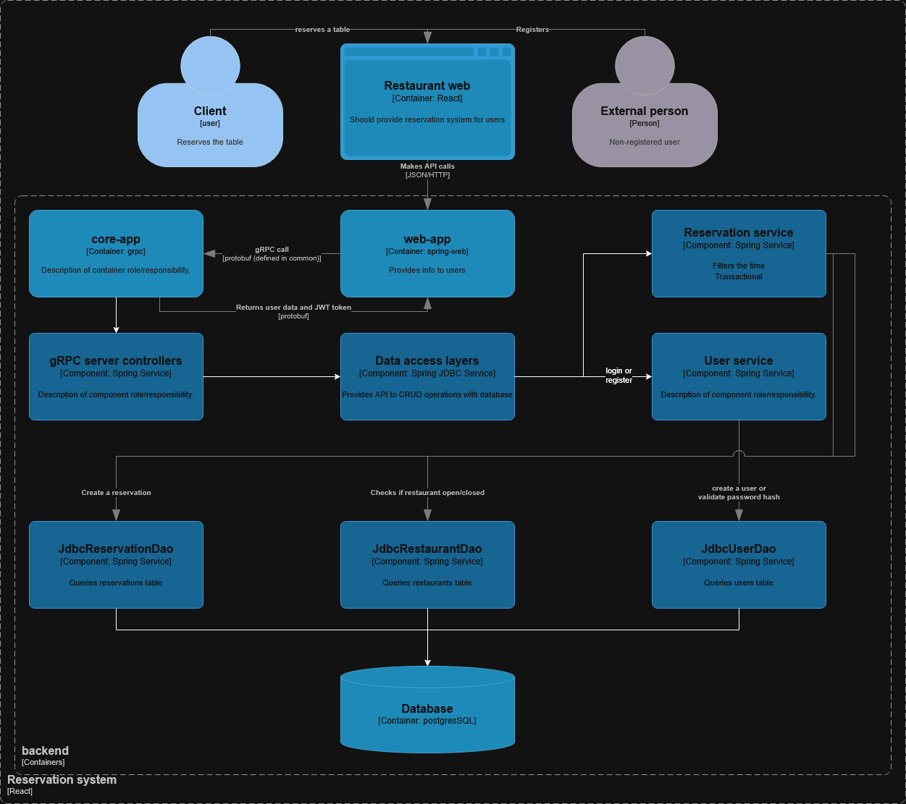
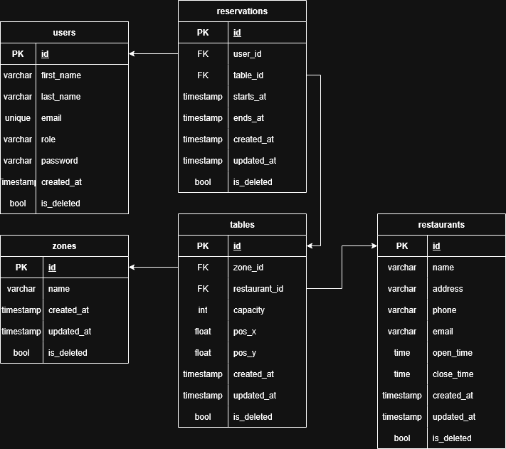

## Project Workflow
### Stack

> Required: \
> Java LTS 25 \
> Spring boot

> Selected: \
> Spring web \
> React + axios + tailwind \
> JDBC \
> gRPC \
> Security: Spring security + JWT

### Visualization:

#### C4 model

#### Entity relation model

## Workflow

Updated the entity relation model
as we need to write an admin-panel it is good to have each entity an
update and creation time.
Also, it is good practice not to delete the entity from
database completely, but to store in the database.
Made it has field isDeleted.
Also moved schema to snake case to prevent mismatch.

Storing huge scripts in the java code is garbage, so I did some research
on how to load resources in the Spring.

Yet there is string queries in the classes, but it would take time
to create a good query builder for them.
Currently, I want to dive into the SQL scripting and don't want to mess with
magic of libraries that do create queries by themselves.

Also to prevent users from booking the same timestamp we create
a transactional methods and to make a validation - we use a service.

Just for a CV, I want to show how can I make a scalable network
so for that reason I created another table - restaurants.
Currently, I think of that Rest-app will validate JWT tokens and will create
requests to GRPC-services (this is where scalability comes in), and the grpc-service
will be responsible for database queries

As I have implemented is_deleted we want to get
only active data, but also we want to get all active and inactive.
For now, I’ll stick only to getting all active data.

Security: Came in mind that password hash shouldn`t be
checked on sql side instead we check it in UserService

Currently the weak point of the system - are permissions.
Before we had user to be responsible for containing his role.
Now I thought that if we want to implement new roles in the system
and for each restaurant (before we could only assign to one restaurant).
Implemented: global role (who you are for the system? System permissions) and
user_restaurant_permissions (what are you permitted to do in specific restaurant?)
I would do instead that roles and permissions are all separated and just give the user
an id of a role, but it will take so much time and nerves.
Yet I have implemented all in user services, but perfectly it is better to implement it
in permissions to keep single-responsibility.

Latest Spring-grpc-client has @ImportGrpcClients and I have dealt with
error that it doesn’t create beans automatically, and it took me so much time to fix, but nothing.
So I have considered to make a beans for each stub instead.
Actually, I have managed to fix this. Don’t really know why wasn't it working,
but the error with "no beans found for..." still shows up, maybe due to IntelliJ cache.

Requests took 400ms but after research
I noticed that it only happens after boot, so I think that
is likely due to lazy initializations. Actually, it is ~100ms and
when response body is empty it takes max of 10-20ms

It is my first time working with React (previously I used Vue)
Almost most part on frontend is written by AI, because
I don’t really have a vision of how to
make a cool-looking website, my strategy was to give a
AI a base and make him upgrade the code and write css.
I switched to tailwind (best practice) because it will show what really is happening
and I won’t paste the AI written css without thinking.

Need to rewrite timestamps on backend side, because I didn’t really
care about time zones, and now it has surfaced.
#### Fjodor Tsumakov