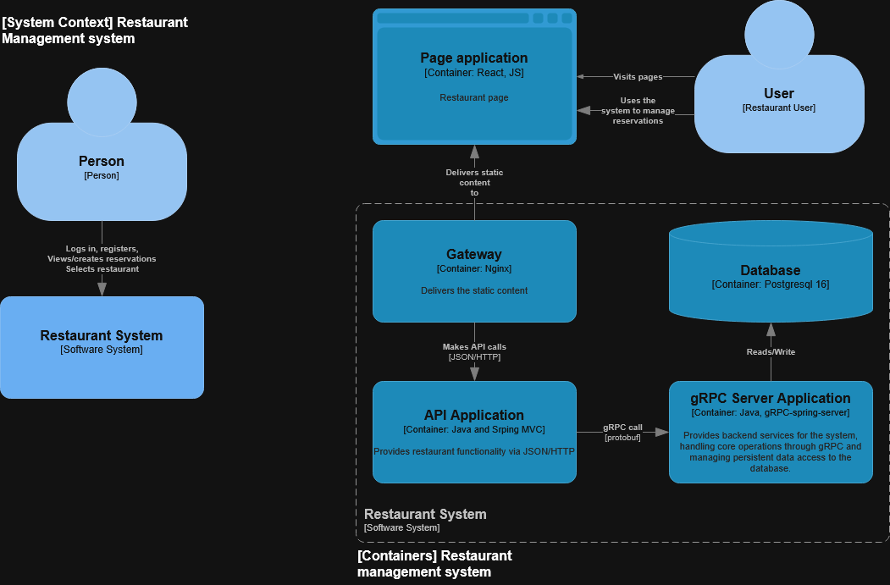
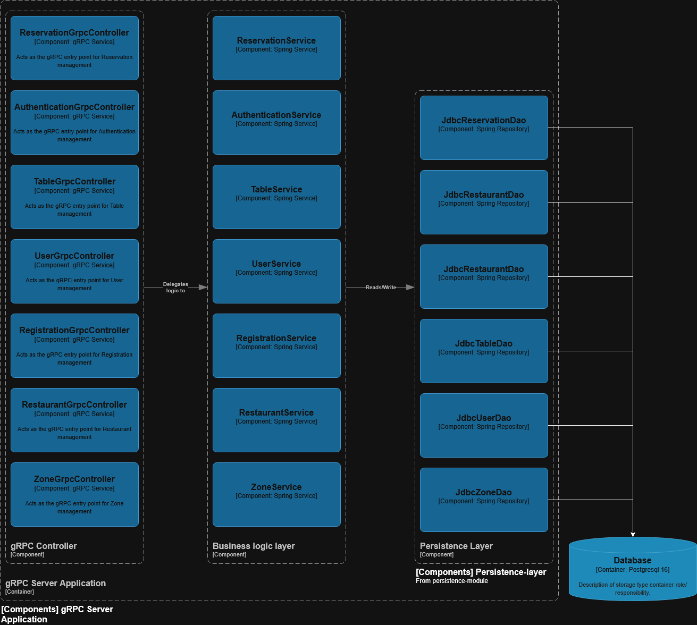
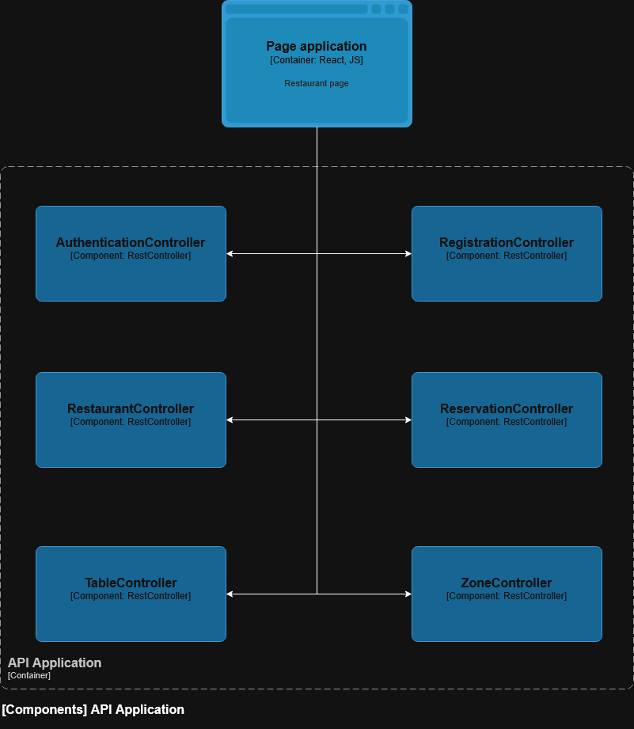
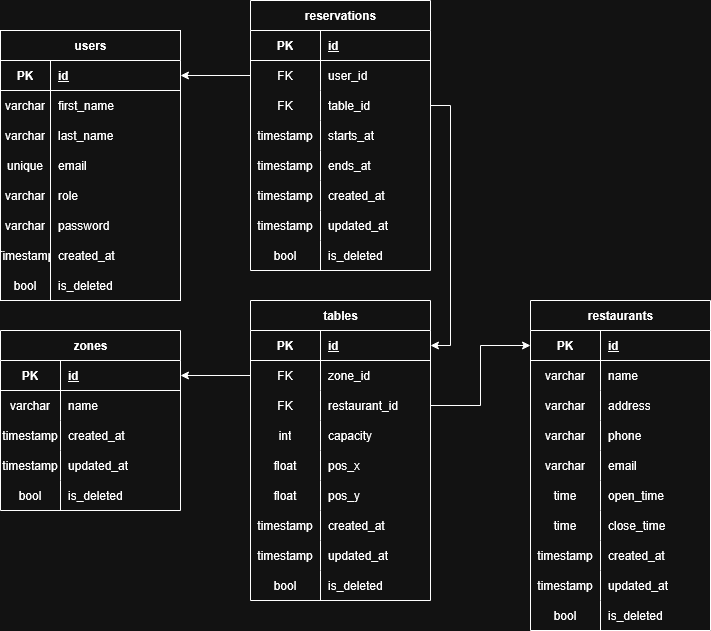

# Project Workflow
## Stack
> Required: \
> Java LTS 25 \
> Spring boot

> Selected: \
> Spring web \
> React + axios + tailwind \
> JDBC \
> gRPC \
> Security: Spring security + JWT

## Visualization:
#### C4 models
### System context

### gRPC Server Application

### Rest API Application

#### Entity relation model

## Workflow

### First steps (1-3 days)
Firstly, defined what we are requirements for building the project and then
started with visualizing the project. Secondly started visualizing the project
with C4 model and Entity Relation Model. That helped me a lot not to start
writing unnecessary classes and methods.
Explored some best-practises and what are using in those systems.

A few days later asked my friend to review the entity relation model, as he is proficient in
databases and frontend. So with that my Entity relation model was complete and I could start
doing all the queries and scripts. To make creating tables a bit faster I asked AI to 
write them for me, because that would take me much time.

### The why
#### Selecting stack
1. Spring-Web (Rest API) - The one that being used with spring boot
2. JDBC - Offers total control over SQL queries. I didn’t want to use 'magic libraries' that will
do all job for me and hide all the processes, and I wanted to practice SQL a bit.
3. Spring-security + JWT - stateless authentication, best for horizontally scaling 
and pretty easy to implement (Wanted to try this)
4. React - component based library like Vue but more efficient. Previously, I only
created frontend with Vue, but React was the thing that I didn’t really want to touch 
due to my fear of frontend :D. \
Sadly, most part of it is AI generated because I didn’t really had time
to create a good-looking web
5. Tailwind - I have heard before, that this is a best library and helps a lot with CSS writing (CSS transparency), and I wanted
to try this someday. So that day came.
6. gRPC - is not needed for the project, but I wanted to make the project scalable and extend my portfolio.

#### Restaurant management system
1. Thought that creating a one-restaurant website was pretty
boring and easy so I made a life a bit harder and made it scalable restaurant system.

### Technical challenges
1. Have created for myself a pain with gRPC and had to write
for each call to backend requests and responses :death-skull:

2. gRPC Integration: Encountered false-positive "No beans found" errors with 
@ImportGrpcClients due to IDE cache issues.\
Fix: SuppressWarnings("SpringJavaInjectionPointsAutowiringInspection") :D or could write beans for each.

3. Implementing permission system, yet it not really implemented but thinking of how should they look in
the database caused a headache.

4. Faced significant issues with timestamp in the db. Fix: Migrated to PostgreSQL timestamptz and 
utilized java.time.Instant in the backend for UTC handling 

5. Setting up composing docker from IntelliJ on my server-laptop

6. Combining student-life, this project writing and having a girlfriend L. Skipped a lot of days and time due to this.

### Improvements that could be made, but no time
1. Implement api-gateway to make the system really scalable
2. Make utility classes for JDBC Dao to remove dupe code & strings
3. Write more queries and services into the persistence-module
4. Implement more GrpcServices and separate them more.
5. Reconsider the package structure
6. RENAME THE CORE-MODULE TO CORE-APP
7. Use Redis to store the cache for user data
8. Make a dedicated authentication-app for validating and creating jwt tokens
9. Use RabbitMQ/Redis to send users notifications
10. Store password encryption token in .env
11. Tests.....

### Raw workflow/notes 
Updated the entity relation model
as we need to write an admin-panel it is good to have each entity an
update and creation time.
Also, it is good practice not to delete the entity from
database completely, but to store in the database.
Made it has field isDeleted.
Also moved schema to snake case to prevent mismatch.

Storing huge scripts in the java code is garbage, so I did some research
on how to load resources in the Spring.

Yet there is string queries in the classes, but it would take time
to create a good query builder for them.
Currently, I want to dive into the SQL scripting and don't want to mess with
magic of libraries that do create queries by themselves.

Also to prevent users from booking the same timestamp we create
a transactional methods and to make a validation - we use a service.

Just for a CV, I want to show how can I make a scalable network
so for that reason I created another table - restaurants.
Currently, I think of that Rest-app will validate JWT tokens and will create
requests to GRPC-services (this is where scalability comes in), and the grpc-service
will be responsible for database queries

As I have implemented is_deleted we want to get
only active data, but also we want to get all active and inactive.
For now, I’ll stick only to getting all active data.

Security: Came in mind that password hash shouldn`t be
checked on sql side instead we check it in UserService

Currently the weak point of the system - are permissions.
Before we had user to be responsible for containing his role.
Now I thought that if we want to implement new roles in the system
and for each restaurant (before we could only assign to one restaurant).
Implemented: global role (who you are for the system? System permissions) and
user_restaurant_permissions (what are you permitted to do in specific restaurant?)
I would do instead that roles and permissions are all separated and just give the user
an id of a role, but it will take so much time and nerves.
Yet I have implemented all in user services, but perfectly it is better to implement it
in permissions to keep single-responsibility.

Latest Spring-grpc-client has @ImportGrpcClients and I have dealt with
error that it doesn’t create beans automatically, and it took me so much time to fix, but nothing.
So I have considered to make a beans for each stub instead.
Actually, I have managed to fix this. Don’t really know why wasn't it working,
but the error with "no beans found for..." still shows up, maybe due to IntelliJ cache.

Requests took 400ms but after research
I noticed that it only happens after boot, so I think that
is likely due to lazy initializations. Actually, it is ~100ms and
when response body is empty it takes max of 10-20ms

It is my first time working with React (previously I used Vue)
Almost most part on frontend is written by AI, because
I don’t really have a vision of how to
make a cool-looking website, my strategy was to give a
AI a base and make him upgrade the code and write css.
I switched to tailwind (best practice) because it will show what really is happening
and I won’t paste the AI written css without thinking.

Need to rewrite timestamps on backend side, because I didn’t really
care about time zones, and now it has surfaced.
#### Fjodor Tsumakov